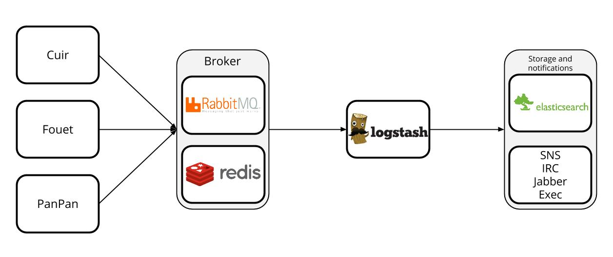

Moustash
========
Moustash is a project which permit to have a scalable notification system.
Moustash is 3 parts project

##Cuir
Cuir is a port prober which send messages to logstash broker

##Fouet
Fouet is an event listener for supervisor, which send a message to a broker each time the status of a process change

##PanPan
PanPan is a cli notifier which use the same modules than Cuir and Fouet

##Infrastructure
Moustash is based on Logstash :

The principle is to have a fast, scalable and easy to install deployment system
Right now,Moustash just support Redis, RabbitMQ wil lcome soon

##Installation
Just clone this repo, then create the good rep for moustash config file ```mkdir -p /usr/local/etc/moustash/```, then create your config file for moustash ```$EDITOR /usr/local/etc/moustash/moustash.ini```. You have some example in the examples folder.

###Cuir
Cuir can be easily use with supervisord :

```
[program:cuir]
command=/usr/local/bin/python /srv/Moustash/moustash/cuir.py
```

###Fouet
Fouet is an event listener, so he need a special config in supervisor : 

```
[eventlistener:fouet]
command=/usr/local/bin/python /srv/Moustash/moustash/fouet.py 
events=PROCESS_STATE
```

###Panpan
Panpan doesn't need any installation : he is just an executable


##Configuration
There is a common configuration file. Because I am a BSD man, I think it's a good idea to put it in /usr/local/etc/moustash/ . But do as you want...

###Moustash
moustash section is the most important : it define which broker you want to, and what are there parameters
* transport : can be redis or rabbitmq
If redis
* redis_ip
* redis_port
* redis_db
* redis_namespace

If RabbitMQ
* rabbitmq_username
* rabbitmq_password
* rabbitmq_host
* rabbitmq_port
* rabbitmq_vhost
* rabbitmq_queue
* rabbitmq_exchange
* rabbitmq_key

__NO SSL FOR THE MOMENT WITH RABBITMQ__

###Cuir
The configuration of Cuir section is very simple : one of the parameter can be Interval (Default is 5 seconds). This interval is how many seconds you will wait between 2 probes

Then you have the configuration of the probes. It's a very simple syntax :
```Program: ip:port:informations```

###Fouet
Fouet doesn't need any parameter, except the Moustash's parameters

###Panpan
Panpan doesn't need any parameter too...

#Why Cuir-Moustach ?
[](http://www.youtube.com/watch?v=VunU_11xwPM)

# Tips

```{"tags": ["test"], "@version": 1, "@timestamp": "2014-05-25T17:01:33.062Z", "host": "wowi.io", "file": "/var/log/test.log", "message": "toto", "type": "test", "program": "cuir", "source": "moustash"}```

date ISO8601

 iso_time = time.strftime("%Y-%m-%dT%H:%M:%SZ", time.gmtime())

supervisor
processname:yaws groupname:yaws from_state:STOPPING pid:31773ver:3.0 server:supervisor serial:4 pool:fouet poolserial:4 eventname:PROCESS_STATE_STARTING len:58
